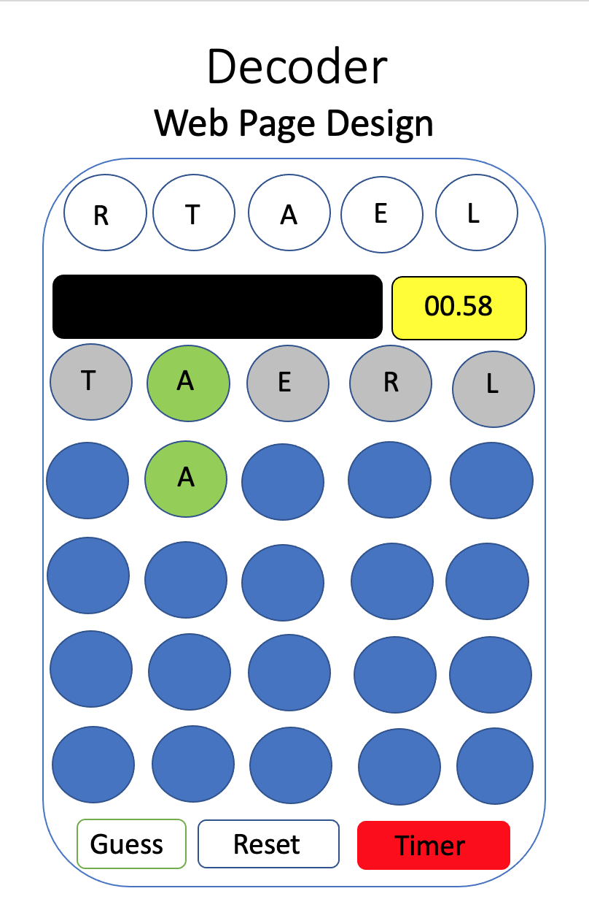

# game-project

Decoder is a game developed using HTML, Javascript and CSS.

A player's task is to guess a word where the letters are scrambled.
At each step of the guess process the player is told whether a letter is
in a correct position or not.

A play who has three wins will level up to the next level and they
will have 1 less guess.  There are three levels.  If a player wins
3 games at the third level the game is over.

A player may setup a Timer to guess the word within 1 minute to make
it more challenging.

# Game Rules

Unscramble the letters to find the word by selecting a letter to play
and checking it against the actual word.  For each guess you are decoding
the word by being told if the letter is in the correct position by being highlighted.

# Instructions
- Unscramble the letters by selecting the letter for each position based off
of feedback provided for each letter.
- Guess within the Time period or in 5 guesses in level 1, 4 guesses in level 2 and 3 guesses in level 3.
- Choose to have a Timer set or not.  The Timer is set to 1 minute. If the Time has expired and the player has not finished the player loses. You cannot toggle the Timer.
- There is no limit to the number of losses to stay at a level. You level up
by having three wins.
- When you reach level 3 and have 3 wins the game is over.

# How to Play
- Select a Letter for the first Letter of a guess until you have selected
five letters making up a word guess.
- Select the Guess Button to see which letters are in the correct position.
- A highlighted letter means it is in the correct position. White indicates the letter is not in the correct position.
- When all five letters are highlighted, you've matched the word and you have a win.
- If you run out of guesses and have not matched the word, you lose.
- If you dislike a word you can select the Reset to have a new scrambled word displayed. This does not effect your wins or losses.
- After 3 wins you will level up to the next round.  At round 2 there are only 4 guesses to match a word.  At round 3 there are only 3 guesses to match a word.
- When you have reached Level 3 and matched 3 words - the game is over.
- You may Toggle the Instructions at any point in the game to understand the
rules.
- The solution will be presented whether you win or lose.
- It is possible to keep losing at any of the rounds and not leveling up.
- To add a challenge you can select Timer to enable a 1 minute Timer to see
if you can finish guessing within that time period.  If you do not guess the
word in that time period, you automatically lose and you are presented with the word.   
- You may not Toggle the timer once it has been set.
- Reset will always deactivate the Timer and display a new scrambled word for guessing.

# Wire Frames

## Game Display

## Making a Guess

## Guess Result with Timer Going

## Solution

## Reset

